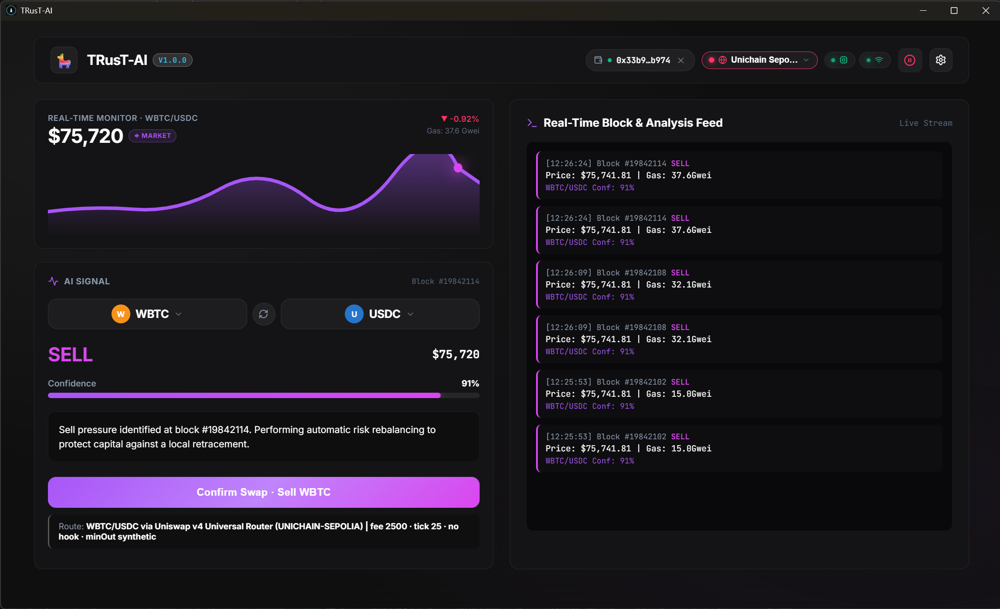
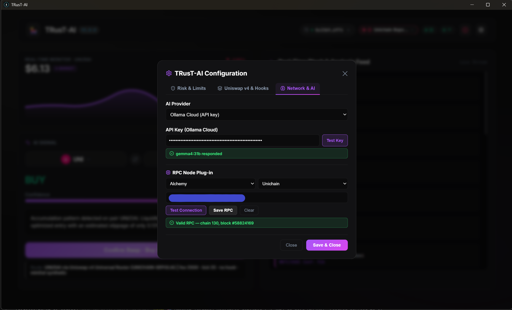

# 🤖 TRusT-AI — High-Performance Autonomous DeFi Agent Platform

[](LICENSE)
[](https://www.rust-lang.org/)
[](https://www.typescriptlang.org/)
[](https://react.dev/)

**TRusT-AI** is a complete orchestration and execution ecosystem for autonomous
agents on DeFi platforms and DEXs (Uniswap v4 / Unichain). It combines the
performance and memory safety of **Rust** for high-frequency on-chain
monitoring, a **TypeScript** orchestrator for flexible LLM integration
(multi-AI provider), and a modern **React** dashboard focused on decision
transparency, multi-provider AI support, and end-user risk management.

<!-- Preview Screenshots -->
<p align="center">
  
</p>

<p align="center">
  
</p>

---

## 🏛️ System Architecture

```
             ┌──────────────────────────────────────────────┐
             │          USER DASHBOARD (React / TS)         │
             │ • Wallet Connection & Agent Status           │
             │ • AI Provider & API Key Configuration        │
             │ • Risk Parameters (Slippage / Stop-Loss)     │
             │ • Pair Selector & AI Throttle Control        │
             └──────────────────────┬───────────────────────┘
                                    │ WebSocket / REST
                                    ▼
             ┌──────────────────────────────────────────────┐
             │       SERVER & AI ORCHESTRATOR (Node / TS)   │
             │ • Multi-AI Gateway (OpenAI/Claude/DeepSeek/  │
             │   Local Ollama / Mock Engine Fallback)       │
             │ • Strategic Reasoning & Risk Analysis        │
             │ • Pair Filter & Rate Limiter (Throttle)      │
             └──────────────────────┬───────────────────────┘
                                    │ HTTP Triggers / IPC
                                    ▼
             ┌──────────────────────────────────────────────┐
             │      EXECUTION ENGINE (Rust / Tokio)         │
             │ • Real-time Block / Pool Listening           │
             │ • Swap Simulation (eth_call) & Gas           │
             │ • Execution on Unichain / EVM Networks       │
             └──────────────────────────────────────────────┘
```

> **Note:** The Rust engine emits synthetic block triggers for high-frequency market analysis,
> while the Node/TS orchestrator performs **live on-chain price resolution** directly from the
> **Uniswap v4 `slot0` pool state** over the user's RPC (with fallback to CoinGecko and synthetic data,
> stamped with a live `◉ LIVE POOL` or `◈ MARKET` badge in the dashboard). See [docs/ROADMAP.md](docs/ROADMAP.md).

---

## 🛠️ Stacks per Component

* **`crates/engine` (Rust Worker):** Rust 2021 with `tokio` async runtime,
  `ethers-rs` / `alloy` ready. Listens to high-frequency EVM / Unichain
  events, computes liquidity metrics, and executes simulation calls.
* **`apps/server` (TypeScript Orchestrator):** Express server and WebSocket
  gateway in Node.js/TS. It is the decision brain of the agent, connecting
  user prompts to multiple LLM providers. Includes a trading-pair filter and
  an AI-call rate limiter.
* **`apps/web` (React Dashboard):** React + Vite + Vanilla CSS. Real-time log
  visualization, transaction history, dynamic AI selector, trading-pair
  selector, analysis interval control, and an emergency pause button.

---

## 🚀 How to Run

### Prerequisites
* **Node.js:** v20+
* **Rust:** v1.80+ (`x86_64-pc-windows-msvc` toolchain recommended on Windows)

### 1. Start the Node/TS Orchestrator
```bash
cd apps/server
npm install
npm run dev
```

### 2. Start the Rust Worker
```bash
cd crates/engine
cargo run
```

### 3. Start the React Dashboard
```bash
cd apps/web
npm install
npm run dev
```

Open `http://localhost:5173` in your browser. The dashboard shows “WS LIVE”
once it connects to the server; the server console shows the engine triggers
once both are running.

---

## 🔐 Web3 Wallet & 1-Click Execution

Wallet connections run through **Reown AppKit + wagmi (2.x) as one shared
store** (`apps/web/src/wallet/`):

* **Browser:** click **Connect Wallet** — MetaMask/Rabby connect via the wagmi
  `injected` connector (or pick them inside the AppKit modal).
* **Desktop .exe / no extension:** the AppKit modal opens a **WalletConnect**
  QR code / mobile deep link; the session is bridged into the same wagmi store
  (`@reown/appkit-adapter-wagmi`), so the header pill, the network selector
  and the swap card all update instantly — no desync between the modal and the
  header.
* The header pill shows the connected address + active chain; the network
  dropdown switches the chain inside the wallet; the ✕ button disconnects.
* Swaps are executed from the **user's own wallet** on **Uniswap v4** (the
  primary route, via the Universal Router — live and validated on Unichain
  Sepolia): ERC-20 inputs are pulled through **Permit2** (token → Permit2
  approve, then Permit2 → router approve), and the router sends the output
  straight back to `msg.sender`, so no calldata patching is needed. The legacy
  v3 route was **removed (2026-09-15)** — the codebase is v4-only. Non-custodial
  end to end — the agent only proposes; the wallet signs.

> **Version pin:** Reown AppKit is only compatible with **wagmi 2.x** — do not
> bump `wagmi` to 3.x without checking `@reown/appkit-adapter-wagmi` support.

---

## ⚙️ Environment Variables (`.env`)

Copy `.env.example` to `.env` and adjust as needed:

```env
# Multi-AI Provider Config (mock | openai | anthropic | deepseek | gemini | ollama_cloud | ollama)
# NOTE: the code reads LLM_PROVIDER, not AI_PROVIDER.
LLM_PROVIDER=mock
# Fallback key; the key typed in the dashboard (localStorage) takes precedence
AI_API_KEY=

# Local LLM (optional)
OLLAMA_BASE_URL=http://localhost:11434

# Real RPC link — paste your provider URL (Alchemy / Infura / QuickNode / public)
# Validated at startup by the engine; used by the orchestrator for live Uniswap v4 slot0 pool price feeds and quoter calculations.
NETWORK_NAME=sepolia
RPC_HTTP_URL=
RPC_WEBSOCKET_URL=

# Default per-signal trade budget (ETH) — the user-set cap the agent may
# propose per trade; the dashboard lets users override it (> 0, < balance).
MAX_TRADE_AMOUNT_ETH=0.25

# Ports
SERVER_PORT=3001
```

> **Note:** when `RPC_HTTP_URL` / `RPC_WEBSOCKET_URL` are configured (or set via the UI RPC Plug-in), the Rust Engine
> validates the RPC connection at startup (`eth_chainId` + `eth_blockNumber`) and the Orchestrator uses it to fetch real-time
> **Uniswap v4 `slot0` pool prices** and live `V4Quoter` swap rates (`price_source: pool`). `PRIVATE_KEY` and
> `ENGINE_PORT` stay reserved/unused (the platform is non-custodial and zero-storage).
>
> The **RPC plug-in** (dashboard → 🔑 API Keys → RPC Provider Plug-in) lets
> users paste an Alchemy/Infura/QuickNode link from the UI instead of editing
> `.env`: the orchestrator keeps it in memory and the engine pulls it from
> `/api/rpc-config` on its next start. See [`docs/ROADMAP.md`](docs/ROADMAP.md),
> [`AGENTS.md`](AGENTS.md) §4/§7 and [`docs/SECURITY.md`](docs/SECURITY.md).

---

---

## 🖥️ Desktop App (Windows `.exe` / NSIS installer)

TRusT-AI ships as a **standalone Windows desktop application** built with
[Tauri v2](https://v2.tauri.app/): a native (WebView2) window hosts the React
dashboard while the Tauri shell spawns the **TS orchestrator** and **Rust
engine** as bundled sidecar executables — the end user never installs Node.js
or Rust.

* The orchestrator is compiled into a single `.exe` via **esbuild + Node SEA**
  (Node's Single Executable Application, `postject` injection).
* The Rust engine is built with `cargo build --release` and bundled as a
  sidecar with its target-triple name.
* The desktop shell binds the orchestrator to **`127.0.0.1`** (no LAN
  exposure) and kills both sidecars when the window closes (no orphan
  processes on port 3001).
* The installer (NSIS wizard, Start Menu shortcut, uninstaller) is produced by
  Tauri and published with a **`SHA256SUMS.txt`** so users can verify
  integrity.

### Build the desktop app locally (Windows)

```bash
npm install            # root (concurrently)
cd apps/server && npm install
cd apps/web && npm install
cd apps/desktop && npm install
npm run build:desktop  # from repo root
```

`build:desktop` chains: `build:web` → server SEA exe (esbuild + Node SEA) →
`build:engine` (`cargo build --release`) → `stage:engine` (copies the engine
into the Tauri sidecar dir) → `build:desktop:shell` (icons + `tauri build`).

The server SEA exe embeds the running `node.exe` and must therefore be built
**on Windows** (or in the `windows-latest` CI job). The engine is a normal Rust
binary; if you develop via WSL you can cross-build it with
`npm run build:engine:windows` (`x86_64-pc-windows-gnu`, needs mingw-w64 in
WSL) and `npm run stage:engine` picks it up automatically — but the full
installer still needs the SEA server exe from Windows.

### Local dev shortcut when the engine sidecar is missing

If a local Tauri dev/build fails with `resource path
'binaries/trust-ai-engine-x86_64-pc-windows-msvc.exe' doesn't exist`, build the
engine and copy the binary into the Tauri sidecar directory with the expected
platform-specific name:

```bash
npm run build:engine
cp "E:/rust_target/release/trust-ai-engine.exe" \
   "apps/desktop/src-tauri/binaries/trust-ai-engine-x86_64-pc-windows-msvc.exe"
```

PowerShell equivalent:

```powershell
npm run build:engine
Copy-Item "E:\rust_target\release\trust-ai-engine.exe" \
  "apps\desktop\src-tauri\binaries\trust-ai-engine-x86_64-pc-windows-msvc.exe" -Force
```

(The exact source path depends on whether `CARGO_TARGET_DIR` is set; the
repo's active Windows config uses `E:\rust_target`.)

Artifacts:
* `apps/desktop/src-tauri/target/release/trust-ai-desktop.exe` — the app
* `apps/desktop/src-tauri/target/release/bundle/nsis/*-setup.exe` — installer

### Verify an artifact

```powershell
# Compare against SHA256SUMS.txt from the GitHub Release
Get-FileHash .\TRusT-AI_0.1.0_x64-setup.exe -Algorithm SHA256
```

### CI/CD release pipeline

`.github/workflows/release-desktop.yml` builds everything on a clean
`windows-latest` runner when a `v*` tag is pushed (or manually via
`workflow_dispatch`), and publishes the installer + `SHA256SUMS.txt` as a
GitHub Release.

> **SmartScreen note:** the executables are **not code-signed** (open-source
> route). Windows will show an *Unknown publisher* warning on first run — that
> is expected; verify the SHA-256 against the release. Code signing via Azure
> Trusted Signing is a documented roadmap item (`docs/SECURITY.md`).

---

## 📌 Roadmap

The full structured product & engineering roadmap (phases, session keys
ERC-4337, Uniswap v4 hooks engine, backlog) lives in
**[docs/ROADMAP.md](docs/ROADMAP.md)**.

Quick summary:

| Feature | Status |
|---|---|
| Session Keys (ERC-4337) | 🔜 Planned |
| Multi-Chain Support | 🔜 Planned |
| Multiple DEXs / Aggregators | 🔜 Planned |
| WalletConnect / AppKit (incl. desktop WebView) | ✅ Implemented |
| Wallet state sync (single wagmi 2.x store) | ✅ Implemented |
| Uniswap v4 Custom Hooks Engine | 🔮 Future module |
| Backtesting Engine | 💡 Backlog |
| Telegram/Discord Alerts | 💡 Backlog |
| Multi-User Dashboard | 💡 Backlog |
| Docker / Cloud Deploy | 🔜 In progress (Phase 4) |
| Dynamic Pair Monitoring (DEX-style picker) | ✅ Implemented |
| Real Market Data in UI (CoinGecko prices + 24h change, top-100 picker) | ✅ Implemented |
| Live On-Chain Price Feed (Uniswap v4 slot0 + CoinGecko ratio) | ✅ Implemented |
| Per-Trade Budget + Signal Cancel | ✅ Implemented |
| RPC Plug-in (UI RPC config) | ✅ Implemented |
| Desktop Distribution (.exe) | ✅ Implemented |

> **Pull Requests are welcome!** If you want to implement any of these
> features, open an issue or send a PR.

---

## 📄 License

Distributed under the **MIT** license. See the [LICENSE](LICENSE) file for
details.